# Spawn Dev Encyclopedia

A shared vocabulary, communication framework, and systems-thinking reference that helps designers, programmers, artists, audio developers, producers, and QA teams align around the complex process of building games.

---

> [!IMPORTANT]
> **Core Thesis:** Game development is not merely the creation of systems. It is the alignment of understanding across multiple disciplines.

---

## Why This Repository Exists

In modern game development, projects rarely fail due to technical impossibility. Instead, they fail due to **communication breakdown**. 

- **Fragmented Terminology:** Beginners and early-career developers encounter a barrage of fragmented terms, making it hard to build cohesive mental models.
- **Discipline-Specific Lenses:** Designers, engineers, artists, audio developers, and producers view the game through fundamentally different lenses. A "system" to a designer is a spreadsheet; to a programmer, it is a state machine; to an artist, it is a set of assets.
- **Friction and Miscommunication:** These differing perspectives lead to teams speaking different languages. Misaligned terms breed project friction, leading to incorrect assumptions, wasted effort, and compromised designs.
- **Accelerated Development:** A shared vocabulary eliminates ambiguity, reduces revision cycles, and accelerates development.

This encyclopedia is built to act as the "operating system" for aligning understanding across these disciplines.

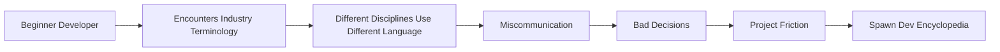

---

## The Communication Problem

At its core, game development is a **multi-disciplinary communication system**. Without a translation layer, key roles operate in isolation, using separate terms that obscure shared goals.

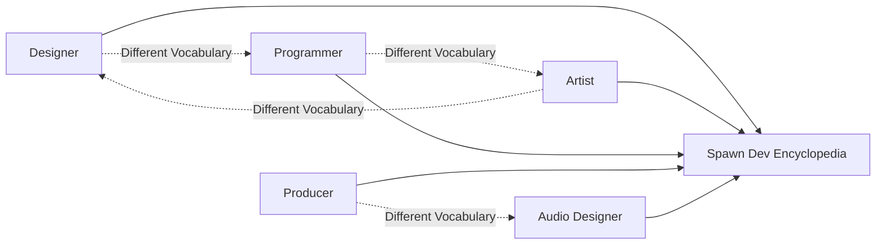

When communication fails, development stalls. Failures in game production are rarely just engineering bugs or design errors; they are alignment mismatches that manifest in the final product.

---

## Overview

This repository is a comprehensive knowledge base designed to help game developers, designers, artists, programmers, and producers develop fluency in the shared language of the game development industry.

It provides a structured reference system for translating terminology, defining workflows, and bridging conceptual boundaries. By establishing a common language, this framework helps teams think in terms of interconnected systems rather than isolated components.

### How to Use This Repository

This is both a **reference system and a learning tool**.

#### Recommended usage:
- Use as a reference during development work
- Study one domain at a time
- Follow cross-links between related concepts
- Revisit terms when encountered in real projects
- Apply terminology in design discussions and documentation

---

## One System, Multiple Perspectives

Every discipline views the exact same game feature through its own unique lens. Understanding a system requires understanding how each role observes and interacts with it.

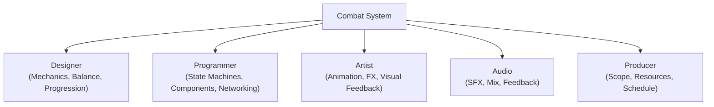

For example, when developing a combat system:
- The **Designer** is concerned with mechanics, balancing, and player progression.
- The **Programmer** focuses on state machines, entity component design, and network synchronization.
- The **Artist** builds animation states, particle effects, and visual clarity.
- The **Audio Designer** shapes the sonic feedback (swords clashing, UI status sounds) and mix prioritization.
- The **Producer** manages the timeline, resources, task dependencies, and feature scope.

This encyclopedia maps these distinct views so each discipline can comprehend the needs and constraints of the others.

---

## Purpose

This framework helps you:
- **De-silo disciplines:** Translate between design, engineering, art, production, and audio.
- **Establish shared vocabulary:** Understand professional terminology in context.
- **Standardize workflows:** Recognize industry-standard pipelines, release strategies, and QA cycles.
- **Build systems-level thinking:** Learn to view features as parts of a larger, interconnected engine rather than isolated elements.
- **Enhance communication:** Reduce project friction by framing design discussions around agreed-upon concepts.
- **Develop senior-level mental models:** Transition from execution-only focus to strategic design and architecture.

---

## Knowledge Translation Layer

The Spawn Dev Encyclopedia serves as a translation layer, mapping discipline-specific terms onto the shared concepts that govern player experience.

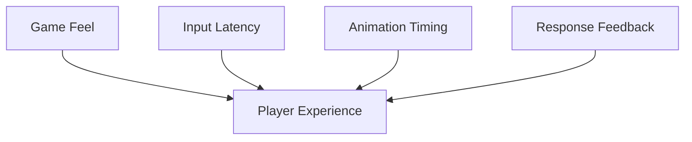

When a designer asks for better "Game Feel", a programmer responds by optimizing "Input Latency", an animator refines "Animation Timing", and an audio engineer adjusts "Response Feedback". All are solving the same underlying problem: optimizing the **Player Experience**.

---

## Cross-Disciplinary Translation Matrix

Many disagreements in game development are not disagreements at all. They are different disciplines describing the same system using different language. Below is a translation matrix mapping key terms:

| Design | Engineering | Art | Production |
| :--- | :--- | :--- | :--- |
| **Game Feel** | Input Latency / Physics Hertz | Animation Timing / Interpolation | Delivery Risk / Polish Allocation |
| **Combat Loop** | State Machine / Entity Update | Combat FX / Action Pose | Milestone / Feature Complete |
| **Reward System** | Economy Architecture / DB Schema | Reward VFX / UI Feed | Retention Goal / Monetization Guardrails |
| **Juice** | Tweening / Ease-in Curves | Particle Assets / Keyframe Accents | Polish Budget / Presentation Risk |
| **Pacing** | Threat Metrics / Spawn Rates | Level Textures / Color Gradients | Scope Control / Narrative Milestones |

One of the long-term goals of this encyclopedia is to act as a translation dictionary, enabling team members to switch fluently between these vocabularies and ensure alignment at all stages of production.

---

## Encyclopedia Structure

The knowledge base is structured around key domains that collectively define the game development process.

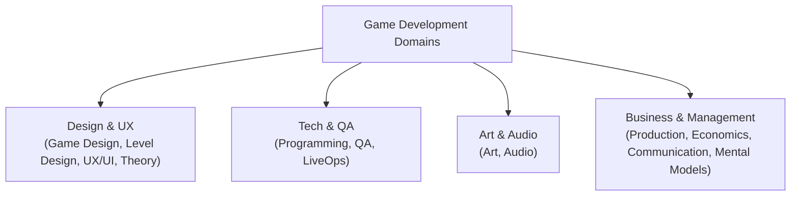

### Domain Outline
- Game Design Systems
- Level Design
- Art & Visual Development
- Programming & Technical Architecture
- Audio Development
- UX/UI Design
- Production & Project Management
- QA & Release Pipelines
- Live Service & Analytics
- Industry Structure & Economics
- Creative Direction & Theory
- Cross-Disciplinary Communication
- Industry Jargon & Acronyms
- Expert Mental Models
- Master Glossary Index

Each section contains structured, cross-referenced documentation.

---

## Learning Paths

We have defined distinct learning paths based on your role or learning objectives. Follow these paths to systematically build your understanding of the material.

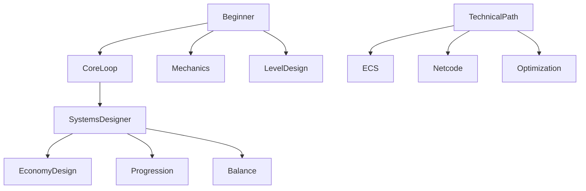

### Path Details

#### Beginner Path
- **Core Loop:** The primary cycle of actions player repeats (e.g., kill, loot, upgrade).
- **Mechanics vs Systems:** The difference between isolated rules (jumping) and dynamic systems (gravity + wind + player weight).
- **Game Feel:** The combination of responsiveness, visual accents, and sound design that makes interactions satisfying.
- **Basic Level Design Concepts:** Flow, guidance, landmarks, and spatial composition.
- **QA & Bug Terminology:** Classifying bugs (crashers, blockers, cosmetic) and writing actionable bug reports.

#### Systems Designer Path
- **Systems Design:** Architecting mechanics that interact dynamically to produce emergent behavior.
- **Economy Design:** Constructing resource faucets, drains, and sinks to maintain game balance over time.
- **Progression Systems:** Structuring XP curves, skill trees, and unlock loops to maintain player engagement.
- **Emergent Gameplay:** Creating rule sets that allow players to find novel solutions.
- **Balance Theory:** Mathematical and psychological methodologies for adjusting game difficulty.

#### Technical Path
- **ECS Architecture:** Entity Component System design patterns for high-performance simulations.
- **Game Loops:** Understanding update rates, variable delta time, and synchronization.
- **Netcode Fundamentals:** Client-side prediction, replication, server authority, and lag compensation.
- **Optimization Concepts:** Draw calls, garbage collection, memory allocation, and profiling.
- **State Machines:** Managing complex game and character states cleanly.

---

## Systems Thinking

Game development is the study of **interconnected, dynamic systems** rather than a collection of isolated features. A change to one component will inevitably cascade through the entire project, impacting mechanics, art budgets, performance, and player behavior.

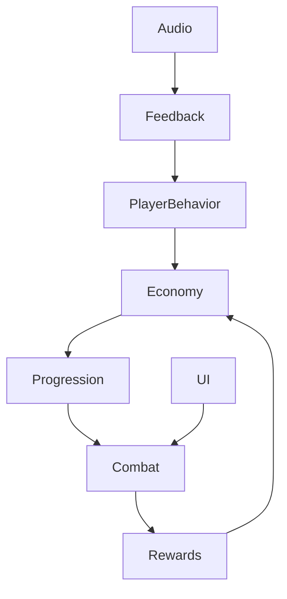

For instance, adjusting the drop rate of a rare sword affects:
1. **The Economy:** The valuation of in-game currency changes.
2. **Progression:** The speed at which players level up increases.
3. **Combat Balance:** Encounters become easier, requiring tuning of enemy health.
4. **UI/UX & Audio:** The feedback loop must properly emphasize the impact of the new gear to trigger satisfaction.
5. **Player Behavior:** Player retention and daily active engagement shift in response to rewards.

Understanding these feedback loops is essential for anyone aiming to design, program, or manage game development.

---

## How Professional Thinking Develops

Professional growth in game development is not just about memorizing facts or learning new software. It is about evolving the sophistication of your mental models and your ability to communicate across disciplines.

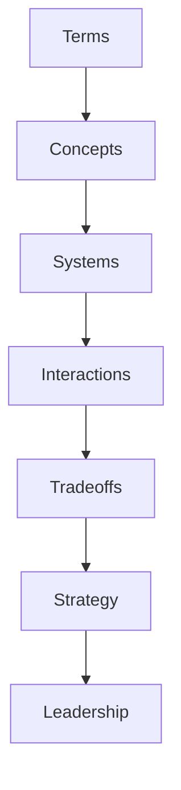

- **Beginners** focus on memorizing **terminology** (e.g., what is a draw call?).
- **Intermediate Developers** understand **concepts** in isolation (e.g., how to reduce draw calls).
- **Senior Developers** analyze **systems** and their dependencies (e.g., how UI design affects draw calls).
- **Leads** evaluate the **interactions** and **tradeoffs** (e.g., should we use extra CPU budget for nicer UI animations or keep it for physics?).
- **Directors & Producers** weigh the **strategic implications** and align teams across disciplines, translating technical limitations into creative solutions.

Expertise is defined by the depth of your mental models and your fluency in cross-disciplinary communication.

---

## Professional Growth Model

The path to seniority is paved with increasing communication fluency and broader system awareness.

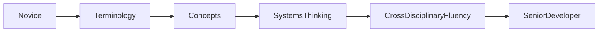

As developers transition from execution-focused roles to leadership positions, the primary skill shift is from *technical execution* to *systems architecture* and *cross-disciplinary alignment*. You must be able to translate your team's constraints and ideas to external departments.

---

## The Encyclopedia Value Chain

This repository is built on a simple premise: vocabulary is not the destination. Shared understanding is the destination.

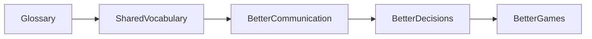

By standardizing terms and bridging discipline gaps, the Spawn Dev Encyclopedia improves decision-making, cuts down on rework, and ultimately leads to more cohesive and polished games.

---

## Core Thesis

At the heart of the Spawn Dev Encyclopedia is a single, visual summary of our philosophy:

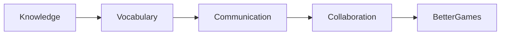

True collaboration is impossible without a common language. Aligning our vocabulary is the first step toward building better games.

---

## Goal

To bridge the gap between early-career developers and professional-level game development communication, building a standard terminology layer that empowers developers to work collaboratively and think in systems.

---

## Future Vision & Roadmap

The Spawn Dev Encyclopedia is the starting point for a larger ecosystem of game development knowledge and collaboration tools.

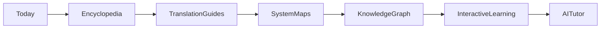

### Development Roadmap
- **Cross-Disciplinary Translation Guides:** Interactive tools to map design ideas directly to programming paradigms and artistic pipelines.
- **Visual System Maps:** High-fidelity diagrams illustrating how typical game systems (e.g., inventory, save/load, matchmaking) interact.
- **Knowledge Graph Navigation:** An interactive visualizer allowing users to trace connections between related terms across different domains.
- **Studio Workflow References:** Real-world examples of how studios structure their pipelines, standups, and documentation.
- **Interactive Learning Experiences:** Simulation exercises where users resolve communication breakdowns in mock game studio scenarios.
- **AI-Assisted Learning Systems:** Interactive tutoring interfaces built to answer domain-specific game engineering and design questions.
- **Real Studio Case Studies:** Deconstructions of production failures and successes from industry veterans.

---

## Contribution Philosophy

This repository is designed to evolve dynamically. We welcome contributions that add clarity, bridge additional disciplines, or supply real-world context to the existing glossary and guide files.

If you would like to contribute:
- Check out the current documentation domains.
- Submit pull requests for clarifications, diagram updates, or new cross-disciplinary translation examples.
- Ensure all additions keep with our core thesis of aligning cross-disciplinary understanding.

---

## License

Educational and community-use focused. Intended for learning and non-commercial knowledge sharing within the Spawn.co community.