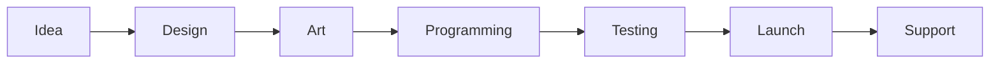
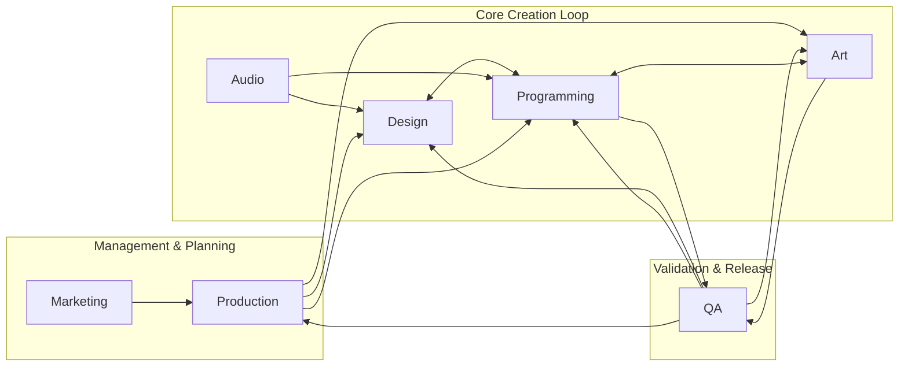
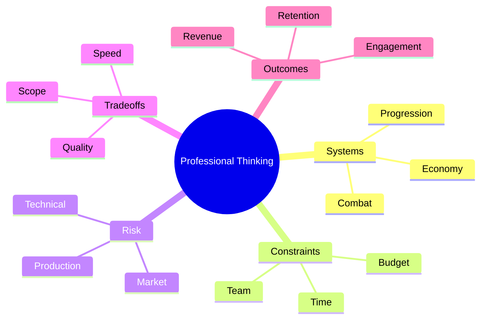
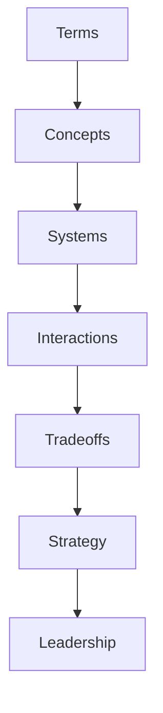
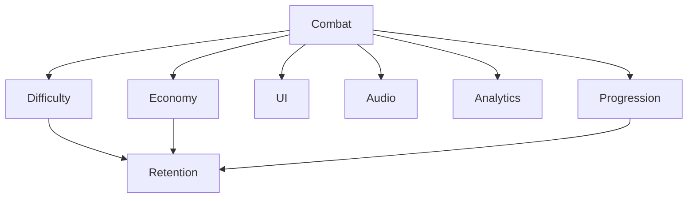
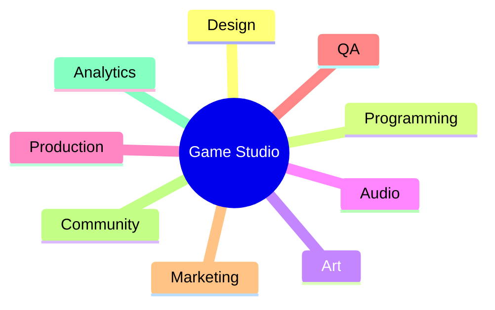
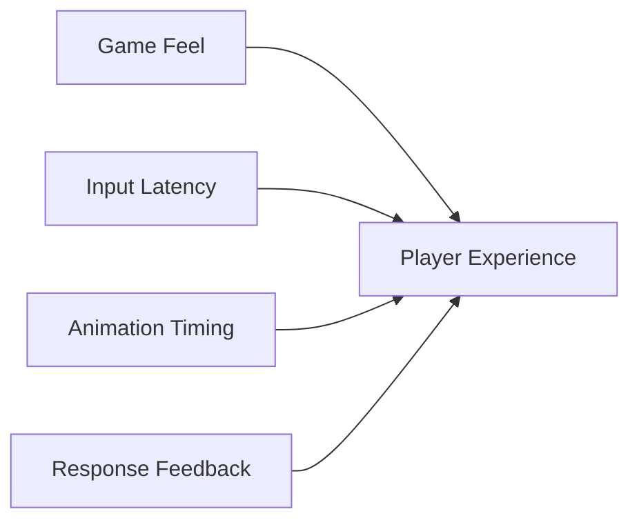
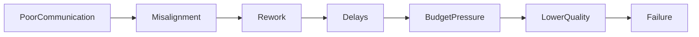
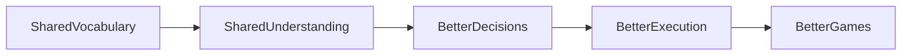

# GAME DEVELOPMENT LANGUAGE & CONCEPTS ENCYCLOPEDIA

## Part I — Foundations of Game Development

---

# Chapter 1: What Game Development Actually Is

Most beginners view game development as:

> "Making a game."

Professionals view game development as:

> "The coordinated production of an interactive software product that delivers intended player experiences under technical, financial, production, and market constraints."

This distinction is important.

### Pipeline vs. Network Thinking

Most beginners imagine game development as a linear, straightforward sequence of steps—a pipeline where one phase finishes and hands off cleanly to the next.


*How beginners imagine game development.*

In reality, professional studios operate in a highly interconnected network of teams, feedback loops, dependencies, and constraints. Game design, art, code, production, and QA are constantly reacting to, modifying, and limiting each other.


*How professional studios actually operate.*

Because changes in one discipline create immediate ripple effects in others, game development is a networked web of relationships, not a one-way conveyor belt.

---

Senior developers do not think primarily in terms of:

- Features
- Art assets
- Code

They think in terms of:

- Systems
- Constraints
- Pipelines
- Risks
- Tradeoffs
- User experience outcomes



Senior developers think in terms of systems, constraints, risks, tradeoffs, and outcomes rather than individual implementation details. Every addition or change is evaluated by its systemic cost, how it affects production schedules, and the risk it introduces to the project.

---

## Layers of Understanding

Expertise in game development develops through a progression of mental models. As developers gain experience, their focus shifts from local components to systemic tradeoffs and strategic alignment.



- **Beginners** focus on memorizing **terminology** (e.g., what is a draw call?).
- **Intermediate Developers** understand **concepts** in isolation (e.g., how to reduce draw calls).
- **Senior Developers** analyze **systems** and their dependencies (e.g., how UI design affects draw calls).
- **Leads** evaluate the **interactions** and **tradeoffs** (e.g., whether to prioritize lower latency or higher visual fidelity).
- **Directors & Producers** weigh the **strategic implications** and align teams across disciplines, translating technical limitations into creative solutions.

True expertise is not just about accumulating facts—it is about developing more sophisticated mental models of how games are built and played.

---

# The Five Layers of a Game

Every game can be understood as five interconnected layers:

```
PLAYER EXPERIENCE       ↑GAME DESIGN       ↑CONTENT       ↑TECHNOLOGY       ↑PRODUCTION
```

## Player Experience

The actual emotions and experiences players feel.

Examples:

- Tension
- Mastery
- Discovery
- Competition
- Wonder
- Fear

A player never directly experiences code.

They experience outcomes.

---

## Design Layer

Design creates:

- Rules
- Goals
- Constraints
- Choices

Examples:

- Health systems
- Economy systems
- Skill trees
- Combat mechanics

Design translates desired experiences into systems.

---

## Content Layer

Content is everything players consume:

- Levels
- Characters
- Weapons
- Animations
- Quests
- Dialogue

A common phrase:

> "Design creates systems. Content fills systems."

---

## Technology Layer

Technology makes everything function.

Includes:

- Rendering
- Physics
- Networking
- AI
- Audio
- Tools

Programmers mostly operate here.

---

## Production Layer

Production coordinates everything.

Without production:

- Deadlines fail
- Budgets explode
- Teams become blocked

Producers optimize information flow.

---

## Everything is Connected

Game development is the management of interconnected, dynamic systems. Adding or changing a single feature does not occur in a vacuum; it sends waves across multiple systems, affecting balance, visuals, performance, and player behavior.



For example, adjusting the damage of a weapon (Combat) directly cascades to:
- **Difficulty & Retention:** If combat is too hard or too easy, retention drops.
- **Progression & Economy:** Players may earn resources faster or slower, distorting the progression loop.
- **UI & Audio:** Visual telegraphs and audio hits must be updated to align with the new combat dynamics.
- **Analytics:** Data tracking must monitor how this tweak shifts overall player behavior.

Viewing a game as a network of connected systems prevents the "silo effect," where one discipline implements a feature that inadvertently breaks another.

---

## The Game Studio as a System

Just as the game itself is a system of rules, the studio that creates it is a system of specialized, coordinated teams.



A successful game requires all parts of the studio to operate as a coherent organism:
- **Design** designs systems.
- **Programming** implements them.
- **Art** and **Audio** fill them with sensory content.
- **Production** plans resource allocations.
- **QA** validates behavior.
- **Marketing**, **Community**, and **Analytics** manage player interactions, expectations, and feedback loops.

---

## The Communication Problem

Because a game studio is composed of separate, specialized disciplines, communication issues are common. Different roles view the game through different lenses and speak separate technical languages, even when they are working on the exact same feature.



- A **Designer** wants to improve **"Game Feel"**.
- A **Programmer** optimizes **"Input Latency"**.
- An **Animator** adjusts **"Animation Timing"**.
- An **Audio Designer** tunes **"Response Feedback"**.

All of them are describing the same target: **Player Experience**. This encyclopedia serves as a translation layer to help these disciplines align their vocabulary and understand each other's constraints.

---

## Why Projects Succeed or Fail

The quality of communication within a studio directly determines the quality of the final game. When communication breaks down, projects enter a negative feedback loop that often leads to failure.



Conversely, establishing a shared vocabulary builds a positive loop of clear decisions and solid execution.



Shared understanding is not a luxury; it is one of the most valuable assets a development team can possess.

---

# Chapter 2: The Development Lifecycle

---

# Pre-Production

Goal:

Determine whether the game should exist.

Many beginners incorrectly think production begins with coding.

Professionals spend enormous effort before production begins.

---

## Concept Phase

Questions:

- What is the game?
- Who is it for?
- Why will players care?

Deliverables:

- High concept
- Pitch deck
- Market analysis
- Initial vision

Common terminology:

### Elevator Pitch

One-sentence game summary.

Example:

> "Dark Souls meets Pokémon in a procedurally generated ocean world."

---

### USP (Unique Selling Proposition)

The core differentiator.

Example:

> Fully destructible voxel cities.

---

### Fantasy

Not genre.

A design term.

Fantasy means:

> The role or experience the player imagines inhabiting.

Examples:

- Space pirate
- Master assassin
- Elite commander

Many design decisions are judged by:

> Does this reinforce the fantasy?

---

# Prototyping

Purpose:

Answer risk questions.

Not:

> Build the game.

Instead:

> Prove assumptions.

Questions:

- Is combat fun?
- Does movement work?
- Can networking support this?

---

## Prototype

Fast.

Ugly.

Disposable.

Built for learning.

Not production quality.

---

## Spike

Programming term.

A temporary implementation used to investigate uncertainty.

Example:

Testing procedural terrain generation.

---

# Vertical Slice

One of the most misunderstood terms.

A Vertical Slice is:

> A small section of the game built to final quality.

Not:

> A prototype.

Not:

> A demo.

A slice demonstrates:

- Gameplay
- Art
- Audio
- UX
- Technology

working together.

Publishers often evaluate projects using vertical slices.

---

# Production

Production means:

> Creating the complete game.

Now systems become:

- Scalable
- Maintainable
- Shippable

---

# Alpha

Feature complete.

Major systems exist.

Not necessarily polished.

Question:

> Does everything exist?

---

# Beta

Content complete.

Focus shifts toward:

- Stability
- Balance
- Polish

Question:

> Does everything work?

---

# Release Candidate (RC)

Potential shipping build.

Multiple RCs may exist.

Example:

RC1  
RC2  
RC3

Until one passes certification.

---

# Gold Master

Historically:

The final build sent for manufacturing.

Today:

The version approved for launch.

---

# Launch

Most beginners believe launch is the end.

Professionals know:

Launch is usually the beginning.

---

# Live Operations (LiveOps)

Continuous management after release.

Includes:

- Events
- Balancing
- Analytics
- Seasonal content
- Community management

Games like:

- Fortnite
- Destiny
- Warframe

are essentially LiveOps products.

---

# Chapter 3: Core Design Terminology

---

# Mechanics

Definition:

Rules governing interaction.

Examples:

- Jumping
- Shooting
- Crafting

Mechanics answer:

> What can players do?

---

# Dynamics

Definition:

Behaviors emerging from mechanics.

Example:

Mechanic:

- Trading

Dynamic:

- Player economies

Players experience dynamics.

Designers create mechanics.

---

# Aesthetics (MDA Framework)

Aesthetic means:

Desired emotional outcome.

Examples:

- Challenge
- Discovery
- Narrative
- Competition

Professionals often work backwards:

```
Emotion→ Dynamic→ Mechanic
```

Not:

```
Mechanic→ Hope it is fun
```

---

# Systems Design

A system is:

> Multiple mechanics interacting through feedback loops.

Example:

```
Combat→ Loot→ Progression→ Stronger Combat
```

Systems designers think primarily in loops.

---

# Feedback Loop

A cycle where outputs influence future inputs.

---

## Positive Feedback Loop

Amplifies advantages.

Example:

Winning provides more resources.

Common in strategy games.

Danger:

Runaway leaders.

---

## Negative Feedback Loop

Helps trailing players recover.

Example:

Mario Kart rubber-banding.

Purpose:

Maintain competition.

---

# Core Loop

Most repeated player activity.

Example:

```
Fight→ Loot→ Upgrade→ Fight
```

A game's health often depends on the quality of its core loop.

---

# Meta Loop

Long-term progression layer.

Example:

```
Matches→ Unlocks→ New Builds→ More Matches
```

---

# Agency

One of the most important design concepts.

Agency:

> Meaningful player influence over outcomes.

Not:

Freedom.

Players can have many options but little agency.

---

# Player Expression

Ability to personalize behavior.

Examples:

- Character builds
- Playstyles
- Cosmetics

High-expression games:

- Minecraft
- Path of Exile
- Baldur's Gate 3

---

# Skill Floor

Minimum competence required.

---

# Skill Ceiling

Maximum mastery possible.

Professional designers often discuss:

> Accessibility versus depth.

This is usually a skill floor/ceiling discussion.

---

# Chapter 4: Professional Design Language

When senior designers discuss a feature, they rarely say:

> "Make it more fun."

Instead they use vocabulary like:

### Readability

Can players understand information quickly?

---

### Clarity

Is intended behavior obvious?

---

### Telegraphing

Communicating future events before they occur.

Example:

Boss wind-up animation.

---

### Affordance

Visual indication of possible interaction.

Example:

A ladder suggests climbing.

---

### Signifier

The cue communicating the affordance.

Example:

Yellow paint on climbable ledges.

---

### Onboarding

Teaching players.

---

### Cognitive Load

Mental effort required.

---

### Friction

Anything slowing player actions.

Sometimes bad.

Sometimes intentional.

---

### Juice

Polish that increases perceived responsiveness.

Examples:

- Screen shake
- Particles
- Sound effects

Game designers often say:

> "This mechanic needs more juice."

---

# The Most Important Shift From Beginner to Professional

Beginners think:

> Features create fun.

Professionals think:

> Systems create experiences.

Beginners ask:

> "What feature should we add?"

Professionals ask:

> "What player behavior are we trying to create?"

Beginners focus on:

- Objects
- Assets
- Mechanics

Professionals focus on:

- Interactions
- Feedback loops
- Incentives
- Constraints
- Emergent outcomes

That mental shift is one of the clearest indicators that someone is beginning to think like a senior game developer rather than simply someone who knows how to make games.