# GAME DEVELOPMENT LANGUAGE & CONCEPTS ENCYCLOPEDIA

## Part II — Game Design Systems & Theory

Game design systems are best understood visually. A system is not a list of features. It is a network of rules, resources, feedback loops, constraints, and player choices that produce behavior over time.

---

# Chapter 1: Systems Design

Systems design is the discipline of creating rules, mechanics, and structures that interact dynamically to produce gameplay experiences. Unlike linear content design, systems design focuses on creating rules that govern a set of behaviors, allowing players to explore possibilities within those boundaries.

## Core Concepts

### System
A collection of parts interacting according to a set of rules to form a unified whole. In game design, a system is composed of multiple mechanics working in tandem (e.g., a weapon system + physical collision system + health system).

#### What A System Actually Is
A system is rarely a single mechanic. Most systems are collections of interconnected mechanics producing emergent outcomes.

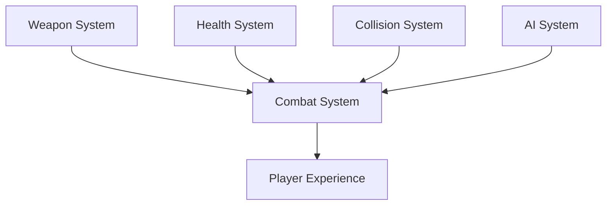

A game system consists of multiple mechanical modules interacting dynamically. When these components connect, they produce a rich experience.

#### Systems Thinking Hierarchy
Professional designers think in terms of interactions rather than individual mechanics.

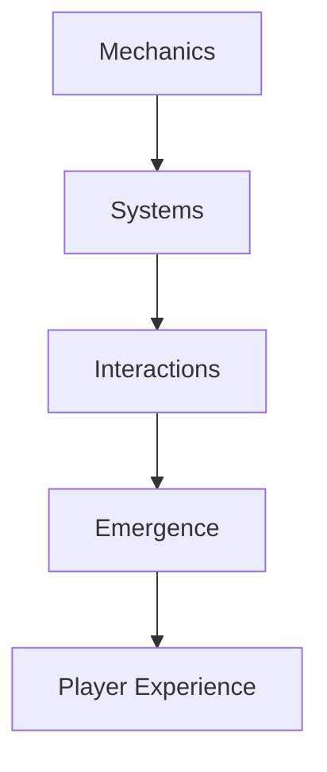

Progressing up this hierarchy shifts focus from single actions to systems, player actions, dynamic emergence, and emotional outcomes.

!!! tip "Designer takeaway"
    A mechanic becomes powerful when it connects meaningfully to other mechanics.

---

### Feedback Loop
A cycle in which the output of a system is routed back as an input, influencing the system's subsequent behavior.

#### Positive Feedback Loop
Positive loops accelerate advantages, creating momentum.

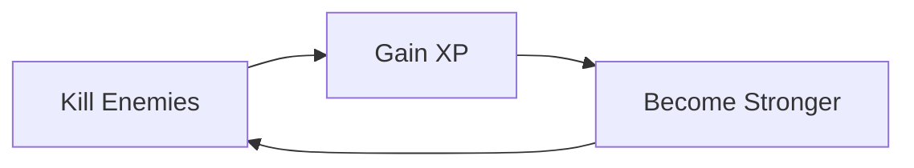

When players win, positive loops increase their capacity to win. This rewards success but can cause runaway leaders if unchecked.

#### Negative Feedback Loop
Negative loops counter changes, creating stability and preventing runaway victories.

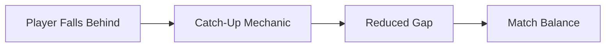

Trailing players receive benefits or leading players face hurdles, keeping the match tight and competitive.

!!! tip "Designer takeaway"
    Positive feedback creates momentum. Negative feedback creates stability.

---

# Chapter 2: Economy Design

Economy design defines the flow of resources through a game. A balanced economy ensures that resources retain value and player choices remain meaningful.

## The Resource Lifecycle

### Faucets (Sources)
The mechanisms through which resources are introduced into the game economy.
- *Examples:* Completing quests (rewards currency), mining ore, looting chests.

### Sinks (Drains)
The mechanisms through which resources are permanently removed from the game economy.
- *Examples:* Repair costs for gear, buying cosmetic upgrades, tax on market transactions.

### Black Holes (Destruction)
Mechanisms that consume high volumes of resources in exchange for temporary buffs or random chances.
- *Examples:* Upgrading gear with a chance of failure/destruction.

#### Resource Flow Model
Every game economy is fundamentally resource flow management.

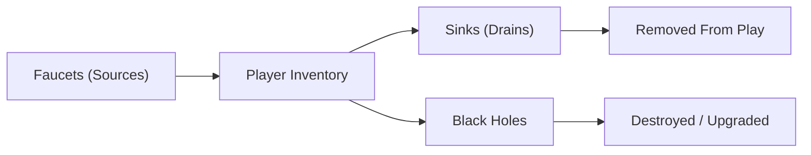

Designers must carefully balance inflow (faucets) and outflow (sinks/black holes) to prevent inflation or stagnation in player resources.

#### Healthy Economy Model
Value emerges from scarcity and meaningful spending opportunities.

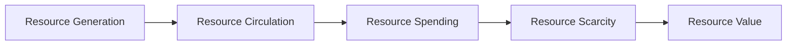

Resources maintain value when they are scarce and when spending opportunities are meaningful to player choices.

!!! tip "Designer takeaway"
    A resource only feels valuable when players have meaningful reasons to earn, spend, save, or risk it.

---

# Chapter 3: Progression Systems

Progression systems govern how a player’s power, options, and status increase over time. Effective progression keeps players engaged by offering regular, satisfying milestones.

## Progression Types

### Vertical Progression
Linear power increases (e.g., higher damage numbers, more health, stronger gear). This type of progression is easy to measure but can make older content obsolete.

### Horizontal Progression
Increasing options and utility without necessarily raising raw power (e.g., unlocking new skills, character classes, traversal techniques, or playstyles). This maintains the relevance of older content but is harder to balance.

#### Vertical vs Horizontal Progression
Progression can increase power vertically or expand choices horizontally.

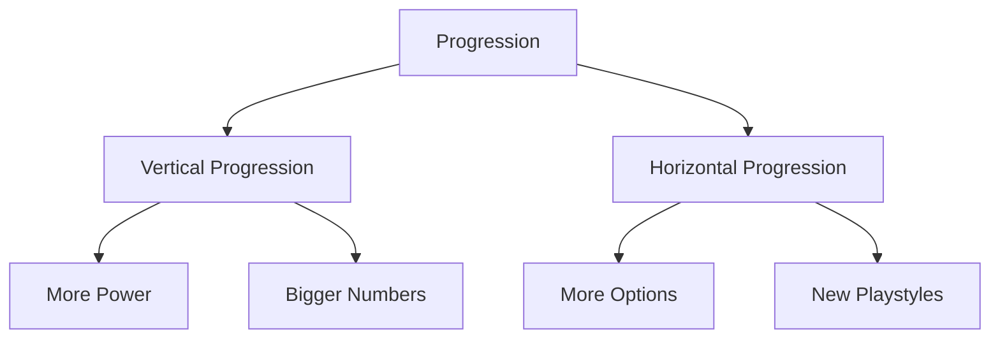

Vertical progression raises power levels but can render content obsolete. Horizontal progression adds new choices and playstyles without inflating base stats.

#### Long-Term Engagement Model
Progression is fundamentally motivational design.

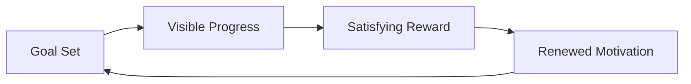

Progression is motivational design. Visible progress toward clear goals keeps players engaged.

!!! tip "Designer takeaway"
    Progression is not just power growth. It is motivation design.

---

# Chapter 4: Emergent Gameplay

Emergent gameplay occurs when players use simple rules and systems in unexpected, creative combinations to produce unique situations.

## Prerequisites for Emergence

### Systemic Autonomy
Individual entities must behave according to consistent, independent rules rather than pre-scripted behaviors.

### Interconnectedness
Different systems must be aware of and react to one another (e.g., fire ignites grass, wind spreads fire, rain extinguishes fire).

#### Emergence Example
No individual rule creates emergence. Emergence occurs when multiple rules interact.

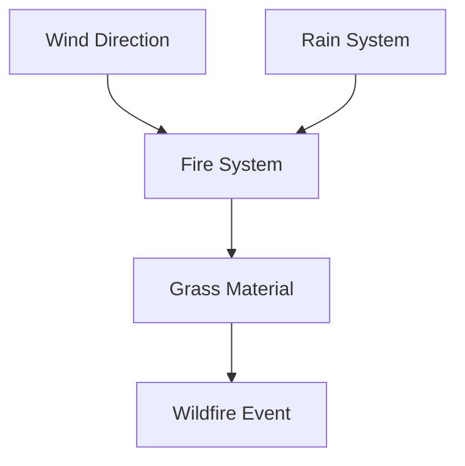

No single system controls the outcome. Simple rules (fire burns grass, wind carries fire, rain kills fire) combine to create unscripted emergent scenarios.

#### Scripted vs Emergent
Understanding the difference between pre-defined linear triggers and open system dynamics.

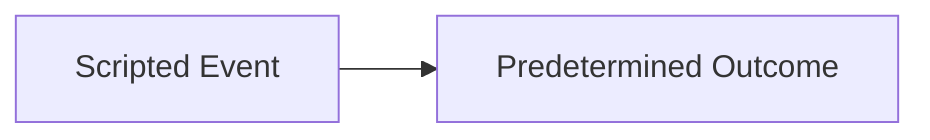
versus
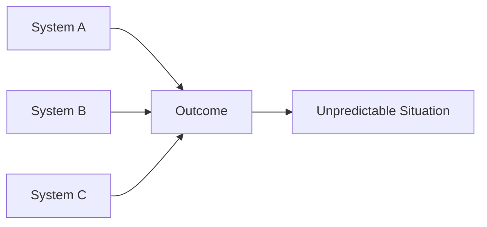

Scripted events lead to a single outcome. Systems combine dynamically to allow players to discover unscripted situations.

!!! tip "Designer takeaway"
    Emergence comes from simple rules interacting in surprising ways.

---

# Chapter 5: Balance Theory

Balance theory covers the mathematical and psychological methodologies for adjusting game difficulty, reward rates, and competitive fairness.

## Balances Types

### Symmetric Balance
Both players start with identical tools and resources (e.g., Chess, classic multiplayer shooters). It is inherently fair but can lead to predictable matches.

#### Symmetric Balance Model
In symmetric balance, players begin with identical resources and tools.

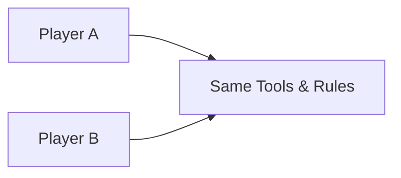

Fairness is guaranteed because players start under identical conditions. Variety depends on strategy rather than tool differences.

### Asymmetric Balance
Players start with different tools, factions, or abilities but have equivalent opportunities for victory (e.g., StarCraft, character-based shooters). It offers high variety but requires extensive playtesting to balance.

#### Asymmetric Balance Model
Balance is not equality. Balance is equal opportunity for success.

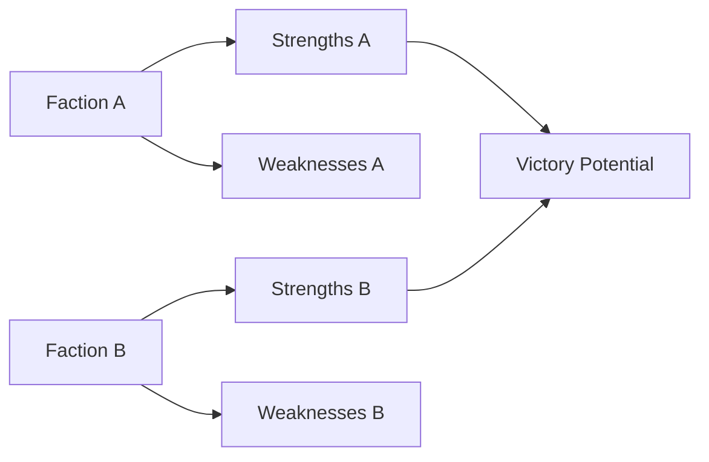

Different toolsets require different strategies, but the potential to win is kept equal through trade-offs.

!!! tip "Designer takeaway"
    Balance does not mean sameness. It means meaningful, fair opportunity.

---

# The Systems Designer's Mental Model

Systems designers do not directly create experiences. They create rules. Rules create behaviors. Behaviors create experiences. This is one of the most important mental model shifts in game design.

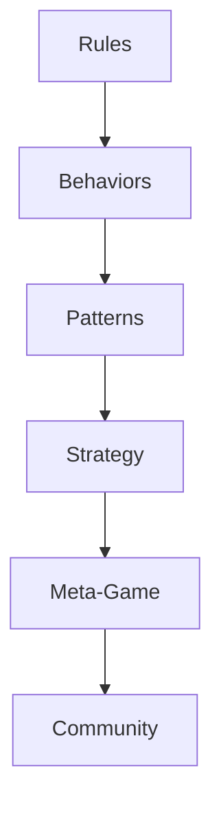

Simple rules dictate player behaviors, which evolve into strategic patterns, forming the meta-game and fostering the community.

## From Rules To Experience
This is the central mental model of systems design. Designers rarely create player meaning directly. They create rule structures that produce interactions, outcomes, and eventually player meaning.

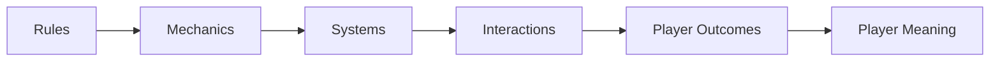

Meaning is derived through active participation in a game's rule structures, mechanics, systems, interactions, and player outcomes.

!!! tip "Designer takeaway"
    Systems designers do not directly design player experience. They design rules that generate player experience.
